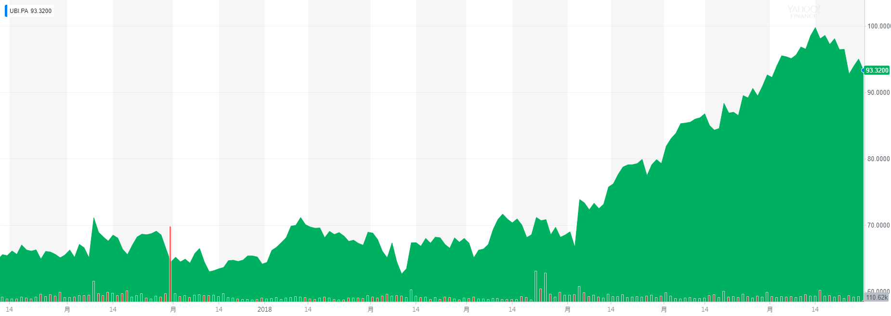
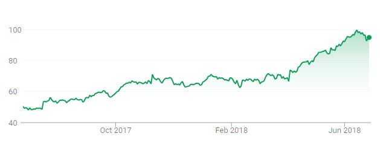
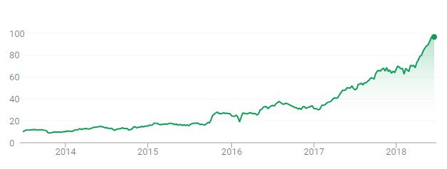
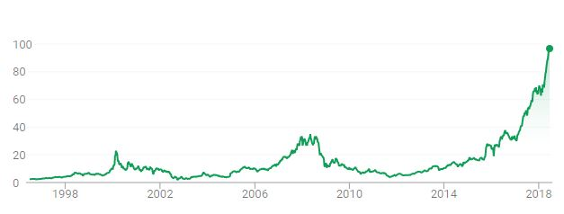
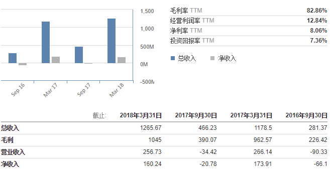
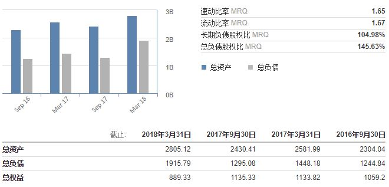
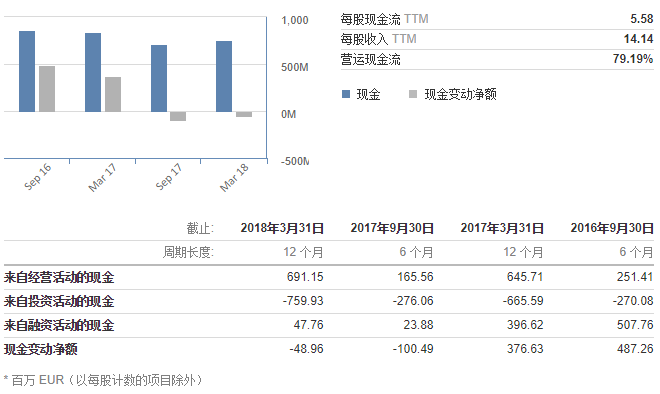

## 财务和股票

###股票Ubisoft Entertainment SA (UBIP)

> 类型:股票 	市场:[法国](https://cn.investing.com/markets/france) 	ISIN:FR0000054470  	股票类型:ORD

3月1日至6月28日股票走势  Yahoo Finance

一年来股票走势		 Google Finance

5年来 		Google Finance

有史以来	Google Finance

### 财务信息

#### 财务摘要

##### 收益表

##### 资产负债表

##### 现金流表

#### 详细完整报表

参考附录 UBISOFT REPORTS FULL-YEAR 2017-18 SALES AND EARNINGS FIGURES 

### 近期重大事件

#### 维旺迪在育碧的全部股权出售，交易详情如下：

- 育碧新的长期投资者，**安大略教师退休金计划**和**腾讯**分别收购3,787,878和5,591,469 Ubisoft股份。
- 育碧股份回购：育碧已承诺通过结构性交易从Vivendi回购7,590,909股本公司的股份，形式如下：
  - （i）Vivendi将育碧股份远期出售给Crédit Agricole Corporate and Investment Bank（CACIB）; 
  - （ii）这是一项涉及育碧从CACIB向前回购自己股票的机制，使育碧能够在2018年至2021年间推迟其回购。
- 由Guillemot Brothers SE购买育碧股份：Guillemot Brothers SE已承诺购买3,030,303 Ubisoft股份。
- 在合格投资者中加速私募13,376,620股Ubisoft股票。

维旺迪自2015年以来稳步增加对育碧股份的控制权，其所有权现在高达其股份的27%(占投票权的24.5%)。根据法国发律，当股份占比达到30%时，将强制获得公司的控股权 。而此次维旺迪在育碧的全部股权出售则使得育碧成功摆脱恶意收购的危险。根据协议条款，在交易完成后五年内，维旺迪公司不得收购任何育碧股份，这意味着育碧仍将继续独立经营。 

 安大略教师退休金计划购入育碧公司3.4%的股份，腾讯公司的购买比例为总股本的5%。两家机构都不会入主育碧董事会。该协议禁止腾讯转让育碧股份，或增加在育碧公司的投票权或股权，目的是防止重演维旺迪事件。

#### 与腾讯签署战略合作协议：

育碧已与腾讯签署战略合作协议，这将增加育碧游戏在中国的曝光度和参与度，并使公司能够接触数百万手机和PC新玩家。

与腾讯合作后，两家公司还会合力将许多育碧的游戏带入中国，这一事件反映出育碧对于中国市场的重视，而育碧的游戏也有望通过腾讯代理进入中国市场。

#### 收购1492 Studio

1492 Studio 是一家专门从事手机免费游戏情景和互动故事开发的游戏开发工作室，成立于2014年，曾推出过一款广受欢迎的手游“Is it Love？”。

*Is it Love?*是一款互动剧情式的游戏。玩家在游戏中通过个人的选择决定剧情的走向，发现更多的内容并发展与游戏角色的关系。“Is it Love”凭借引人入胜的故事、风格化的美术及互动设计，成功杀入法国模拟类手游排行榜前5名，并在美国登上了手游排行榜的前20。“‘Is it Love’在同类型的触发式、叙事式手游中名列前茅，玩家在游戏社群中热烈参与。本次收购符合育碧一贯的战略，我们希望通过明智的、目标明确且收益显著的收购业务，来接触新的玩家市场。”育碧手游执行总监Jean-Michel Detoc如是说。

这次收购完成于2018年2月28日，将为育碧带来立竿见影的营收增长，同时也反映了其对新玩家市场的试探。日前恋爱模拟游戏呈上升趋势，而女性消费者的巨大潜力也逐渐显现；与此同时，手机端游戏蓬勃发展营收比重不断增加，而育碧痛失gameloft后在手游领域名气大减。在此时育碧对这一新兴市场进行的实验性收购，可能将带领3A游戏大厂走进一个手机端新的游戏领域 。

#### 收购Blue Mammoth Games

Blue Mammoth Games是一家专门从事PC和PS4免费游戏的多人游戏的游戏开发工作室，成立于2009年，曾开发游戏《格斗哈拉 》（Brawlhalla） 。

《格斗哈拉》是一款流行F2P格斗游戏，育碧形容该作是“Steam平台玩家游玩次数最多的格斗游戏”，以及“PS4平台最顶尖的F2P作品之一”。育碧还提到了《格斗哈拉》作为一款竞技类游戏的潜力。“Blue Mammoth的团队是开发和运营大型竞技多人网游的专家，能大大增进 育碧旗下工作室阵容的实力 。”育碧北美、中美及南美洲总裁Laurent Detoc在一份声明中表示，“《格斗哈拉》是一款非常受欢迎的畅销游戏，与我们扩大用户群体，为玩家们提供持久娱乐游戏体验的战略相一致。”

这次收购在2018年3月1日正式完成，Blue Mammoth Games 目前由21名开发人员所组成，在加入育碧旗下后仍会专注于《Brawlhalla》的经营， 而 Blue Mammoth Games 的营运在之后也会加进育碧整体获利统计当中 。育碧这一收购，不仅获得《Brawlhalla》带来的收益，也有望在其相关多人竞技网游（如全境封锁、彩虹六号：围攻等）的发展中能有新的突破和创新，提升多人在线对战游戏的游戏体验。

#### 在印度，乌克兰和加拿大宣布可设新的工作室

育碧最近连续开设了三家新工作室，分别有育碧敖德萨（乌克兰），育碧孟买（印度）和育碧温尼伯（加拿大） 。

孟买和敖德萨工作室将专注于共同开发3A游戏和发布后游戏支持。

 温尼伯工作室由《孤岛惊魂5》制作人Darryl Long带头负责，温尼伯工作室的主要负责领域是开放世界搭建，该工作室计划了100人规模的团队，计划在未来五年内提供支持保障。 温尼伯工作室将在共同开发3A游戏方面发挥战略作用，并致力于开发工具和技术。

育碧的新工作室专注3A级游戏大作的开发和提供技术支持。对此，育碧加拿大工作室CEO Yannis Mallat表示：“制作这些庞大的数字世界正在变得越来越复杂。因此让我们的开发团队在迅速发展和竞争激烈的市场中，能使用到最先进的技术、工具去开发最具创新性的游戏，是非常重要的。” 

曾就职于EA，拥有超过17年游戏研发经验的Patrick Bach将担任工作室总监与新工作室的其他成员一同加入到这创意的大家庭中来。育碧斯德哥尔摩工作室总监Patrick Bach，拥有超过17年的游戏开发者经验，曾在EA DICE就职15年，此前则从事商业短片及3D制图方面的工作。曾参与制作《RalliSportChallenge2》、《战地：叛逆连队》及《战地：叛逆连队2》、《战地3》和《战地4》，并在《星球大战：前线》、《镜之边缘：催化剂》以及《战地1》的研发过程中负责团队监督工作。

育碧新工作室的成立表明了育碧未来对研发高质量3A游戏的雄心。此外斯德哥尔摩工作室的建立，鉴于斯德哥尔摩是全球最重要的游戏中心之一 ，此举将吸引更多创意人才进入育碧，以增强其研发力量，推出新的游戏大作和游戏技术。

> **参考商业网站：**
>
> - https://hk.finance.yahoo.com/quote/UBI.PA?p=UBI.PA
> - https://cn.investing.com/equities/ubisoft-ratios
> - https://www.bloomberg.com/quote/UBI:FPhttps://osiris.bvdinfo.com/