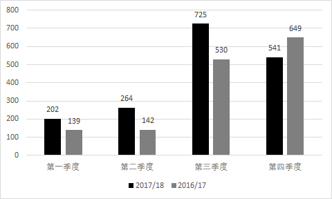
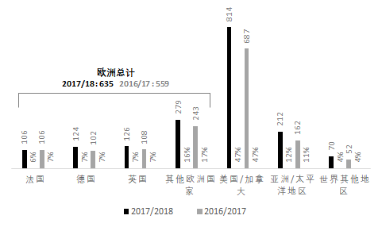
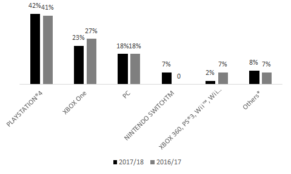

## Sales and Earnings 2017-18

### 2017-18 销售与盈利概述

表现超预期，盈利能力达到新水平。

- 全年总销售额达**17.319亿**欧元，同比上涨**18.6**％，超过16.4亿欧元的预期目标。 
- 作品表现持续出色：
  - FarCry®5：发布首周创收3.1亿美元，育碧有史以来发布销量第二大的游戏。
  -  Assassin’s Creed® Origins：
    -  2017年行业EMEA地区畅销榜第三
    - 玩家平均人数达到逾期二倍
  - Rainbow Six® Siege ：超过3000万注册玩家，2017-18第四季度游戏赛季参赛人数以及六人邀请赛的电视观众人数增加约300.0％
  - The Division® ：注册玩家超过2000万。
  - Ghost Recon® Wildlands ：注册玩家超12000万。
  - 2017-18 财年第四季度打破最高同时在线玩家人数记录。
  - 全年数字营收增长37.8％，达10.047亿欧元（占总销售额的58.0％，而上一财年为50.0％）
    - PRI(玩家再消费，包括数字项目，DLC，季票，订阅和广告的销售额)急剧增加：增加58.7％至4.825亿欧元（占总销售额27.9％，2016-17年为20.8％）
      - 其中移动收入增长66.2％
  - 旧作年度销售额增长27.2％至826.0百万欧元（占总销售额的47.7％，而2016-17年为44.5％），这反映出育碧作品日益经典且持续流行。
- 非国际财务报告准则的营业收入增加26.2％至3.010亿欧元，超过目标2.7亿欧元。
  - 非国际财务报告准则经营利润率达到17.3％的历史新高（2016-17年为16.3％）

### 2018-19年盈利目标 

集团正按其非国际财务报告准则计算营运收入及现金流量目标。

联合创始人兼首席执行官Yves Guillemot表示：

> 育碧结束了本财年的一个非常积极的消息，持续出色的执行力。由于游戏的质量，强大的现场服务以及对玩家社区的深入承诺，本集团进一步加强了品牌。在第四季度，我们达到了最高并发用户纪录，这要归功于Rainbow Six Siege的参与级别和esports观看次数，成功推出Far Cry 5--育碧历史上第二大发布会 - 以及刺客信条起源持续强劲的表现，马里奥+拉比王国之战以及我们的旧作销售。因此，我们的绩效表现超越了我们的财务目标，销售额创纪录，数字和目录收入以及盈利能力均创历史新高。
>
> 在短期和中期内，育碧有许多增长机会可以挖掘和预期进一步的盈利增长。我们的数字化转型正在以比我们预期的更快的速度发展。我们在PC和移动市场的潜力巨大，特别是在中国。
>
> 最后，我们正在继续开发和构建我们的电子竞技产品，这是一个重要的机会。从长远来看，新的游戏形式，特别是通过流式传输，将使我们的品牌能够吸引更多的观众。因此，我们正在投资我们的在线服务平台，该平台拥有8,800万独特的现役玩家4以及人工智能，以更好地为每位玩家调整游戏体验，从而为他们提供更丰富的体验。

> “Ubisoft ended the fiscal year on  a very positive note, with continued excellent execution across the board. The Group further  strengthened its brands thanks to the quality of its games, strong live services and a deep  commitment to player communities. During the fourth quarter, we reached a record of peak  concurrent users thanks to record engagement levels and esports viewership for Rainbow Six  Siege, the successful launch of Far Cry 5 – the second biggest launch in Ubisoft’s history – and  continued strong performance by Assassin’s Creed Origins, Mario + Rabbids Kingdom Battle and  our back-catalog titles. As a result, we have outperformed our financial targets, with record-high  sales, digital and back-catalog revenues, and profitability.  
>
> In the short and medium term, Ubisoft has many growth opportunities to tap and expects further  profitability increases. Our digital transformation is progressing at a faster pace than we  anticipated. Our potential in the PC and mobile markets is massive, notably in China. Finally, we  are continuing to develop and structure our esports offering, which represents a significant  opportunity. 
>
>  Over the longer term, new forms of gaming, enabled notably by streaming, will allow our brands  to reach a much wider audience. Consequently, we are investing in our online services platform  – which boasted 88 million unique active players4 – as well as in artificial intelligence in order to  better tailor the game experience to each player’s profile and therefore offer them ever-richer  experiences.”

###销售明细

#### 季度和年度总营业额（百万欧元）

| 营业额（百万欧元） | 2017/18 | 2016/17 | 按现行汇率的变动 | 按固定汇率*的变动 |
| ------------------ | ------: | ------: | ---------------: | ----------------: |
| 第一季度           |     202 |     139 |            45.2% |             45.7% |
| 第二季度           |     264 |     142 |            85.8% |             88.6% |
| 第三季度           |     725 |     530 |            36.8% |             41.0% |
| 第四季度           |     541 |     649 |           -16.6% |            -11.2% |
| 全年总计           |    1732 |    1460 |            18.6% |             22.9% |

*用于计算固定利率营业额的方法是，对期间数据应用上一个财政年度同期使用的平均汇率。

#### 按地区划分的销售额（百万欧元）

| 区域         |      销量% |      销量% |           销量% |          销量% |
| ------------ | ---------: | ---------: | --------------: | -------------: |
|              | Q4 2017/18 | Q4 2016/17 | 2017/18  12个月 | 2017/18 12个月 |
| 欧洲         |        35% |        36% |             37% |            38% |
| 北美洲       |        45% |        48% |             47% |            47% |
| 全球其他地区 |        20% |        16% |             16% |            15% |
| 总计         |       100% |       100% |            100% |           100% |

#### 各平台销售明细

| 平台                         |      销量% |      销量% |       销量% |        销量% |
| ---------------------------- | ---------: | ---------: | ----------: | -----------: |
|                              | Q4 2017/18 | Q4 2016/17 | 2017/18全年 | 2016/17 全年 |
| PLAYSTATION®4                |        43% |        46% |         42% |          41% |
| XBOX One                     |        23% |        30% |         23% |          27% |
| PC                           |        21% |        17% |         18% |          18% |
| NINTENDO SWITCHTM            |         5% |          - |          7% |            - |
| XBOX 360, PS®3, Wii™, Wii U™ |         1% |         2% |          2% |           7% |
| Others*                      |         7% |         5% |          8% |           7% |
| 总计                         |       100% |       100% |        100% |         100% |

`*移动，辅助设备`

#### 第一季度 发行计划 **（2018年4月 -  6月）** 

##### PACKAGED & DIGITAL 实体版和数字版

| 游戏名                                                     | 平台                         |
| ---------------------------------------------------------- | ---------------------------- |
| FAR CRY® 3 CLASSIC EDITION                                 | PLAYSTATION®4, Xbox One™     |
| MARIO + RABBIDS® KINGDOM BATTLE GOLD EDITION (retail only) | NINTENDO SWITCH™             |
| SOUTH PARKTM THE FRACTURED BUT WHOLETM                     | NINTENDO SWITCH™             |
| THE CREW® 2                                                | PLAYSTATION®4, Xbox One™, PC |

##### DIGITAL ONLY  仅数字版

| 游戏名                                                  | 平台                         |
| :------------------------------------------------------ | ---------------------------- |
| FAR CRYTM 5 - HOURS OF DARKNESS                         | PLAYSTATION®4, Xbox One™, PC |
| FOR HONOR® SEASON 6 HERO’S MARCH                        | PLAYSTATION®4, Xbox One™, PC |
| MARIO + RABBIDS® KINGDOM BATTLE - DONKEY KONG ADVENTURE | NINTENDO SWITCH™             |
| MIGHT & MAGIC® : ELEMENTAL GUARDIANS                    | Google play, App store       |
| TOM CLANCY’S RAINBOW SIX® SIEGE OPERATION PARA BELLUM   | PLAYSTATION®4, Xbox One™, PC |

### 展望

- 销售额目标 20亿欧元
- 净订购额约为2050.0百万欧元（之前的目标为21.0亿欧元），计算依据如下
  - 发布了三款新的3A游戏（The Crew®2，The Division®2和另外一个未宣布的特许经营权的游戏），代表了1900万（相对于之前的四个3A版本和2,300万）。根据以前的做法，鉴于集团数字化转型的加速，旧作销售的增长以及近期发布的良好势头，育碧决定给自己更多时间开发Skull＆Bones，为玩家提供更具吸引力的体验。Skull＆Bones 现在计划在2019-20发布。
  - 数字收入预计约占净订单的65％（与之前的约60％相比），而PRI应占净订购额的30％左右（而之前的目标为超过25％）。
  - 预计旧作销售约占净订单的50％（而之前的目标为超过45％）。
- 非国际财务报告准则的营业收入（基于净订购额）约为4.4亿欧元。
- 自由现金流约3亿欧元。
